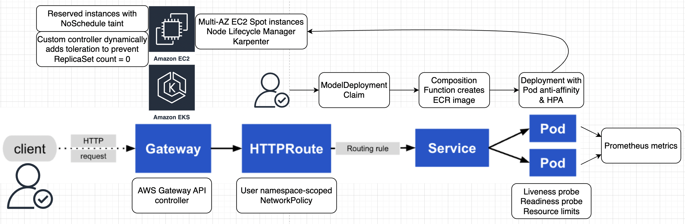

# Cloud-Agnostic Developer Self-Service Platform

[](https://github.com/CarlosLaraFP/k8s-platform/actions)

Developer self-service Kubernetes platform built with Crossplane on Karpenter-based AWS EKS Auto. Core infrastructure managed with Terraform & ArgoCD and user-created cloud resources managed via Crossplane Claims. This includes a Helm-packaged custom Kubernetes controller to automate the lifecycle of ephemeral AWS resources based on TTL logic defined at the Claim level. Platform UI rendered in-browser - making all underlying infrastructure invisible to end users.



---

## 🚀 Features

- **Terraform** to provision:
    - Karpenter-based EKS Auto cluster
    - Docker image lifecycle management with ECR
    - Crossplane Helm chart for self-service IaC
    - Custom Kubernetes controller Helm chart
    - EKS Gateway API controller Helm chart
    - RBAC & least privilege access
- **Crossplane-native AWS resource provisioning** via `Composition` and `XRD` definitions  
- **Custom Kubebuilder controller** to automatically delete transient claims after `T` hours  
- **Prometheus metrics** exported for reconciliation counts, durations, and cleanup results  
- **Helm-packaged** for seamless deployment into any Kubernetes cluster
- **ArgoCD-driven GitOps** to keep EKS resources up-to-date
- **Makefile-driven development & GitHub Actions CI**
- **Tested on local KinD** and on Terraform-provisioned EKS Auto with real AWS credentials
- **Unit tests using `controller-runtime` fake client** and Prometheus test harness

---

## Roadmap

- Ingress -> Gateway API on EKS
- Kubeflow to enable self-service for data scientists, including Jupyter notebooks backed by persistent volume claims (PVCs)
- Multi-AZ EC2 Spot node groups with user-provided flag for GPU instances
- Pod disruption buckets (PDBs) to limit blast radius of EC2 Spot termination signals
- GPU taint prevents scheduling of non-GPU workloads; toleration patched dynamically based on user input
- Pod anti-affinity defaults for high availability and fault tolerance
- Argo Workflows for DAG-based workloads (user & internal), including automatic Docker build, tag, and push to ECR
- Admission controller to validate IAM least privilege access; mutation can patch dynamically
- Extend Prometheus metrics and add Grafana dashboard with notifications

---

## Setup

```bash
# For local testing with KinD
make deploy # after cloning the repo, replace mock-aws-credentials.txt with aws-credentials.txt
make apply
make destroy

# For cloud testing with EKS
make terraform-apply
make terraform-destroy # cleanup once you are done
